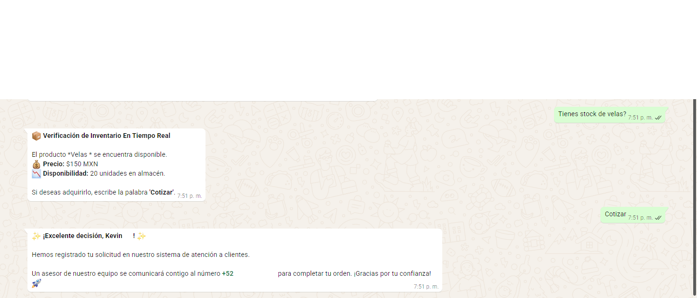
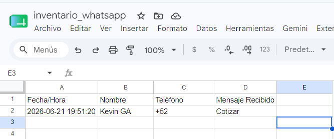
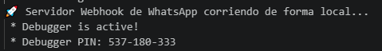

# Motor de Automatización Comercial: WhatsApp Business Webhook & Google Sheets API 🚀

Este sistema representa una solución integral de optimización de procesos y generación de prospectos (*Lead Generation*) diseñada en Python. Permite interconectar el canal de mensajería interactiva de WhatsApp (vía Twilio API Gateway) con una base de datos distribuida en la nube basada en Google Sheets, actuando como un micro-ERP comercial automatizado de alta disponibilidad.

## 📷 Demostración Funcional en Tiempo Real

### 1. Consulta de Inventario con Filtro de Puntuación
El asistente intercepta mensajes entrantes en lenguaje natural, normaliza el texto eliminando caracteres especiales (`¿?¡!`) y realiza una consulta dinámica en la hoja de cálculo para validar stock y precios en milisegundos:

### 2. Persistencia en la Nube y Captura de Leads Automatizada
Si el cliente activa una intención explícita de compra o cotización (`"Cotizar"`, `"Me interesa"`), el núcleo del software calcula la estampa de tiempo e inserta asíncronamente los datos de perfil del usuario en una pestaña dedicada de Google Sheets:

### 3. Backend de Control de Grado de Producción
Servidor asíncrono robusto construido bajo el microframework `Flask`, controlado por logs de auditoría en terminal para diagnóstico y trazabilidad de eventos:

## 🛠️ Características Técnicas
* **Limpieza Sintáctica Avanzada:** Robustez algorítmica para emparejar cadenas de texto ignorando dedazos, mayúsculas o signos de puntuación.
* **Escritura Dinámica (On-the-fly):** Inicialización y formateo automatizado de estructuras de datos (columnas y hojas) si el archivo central no cuenta con ellas.
* **Seguridad y Aislamiento de Secretos:** Arquitectura protegida mediante inyección de variables de entorno (`.env`) para mitigar fugas de credenciales en servidores públicos.

## ⚙️ Tecnologías Utilizadas
* **Lenguaje:** Python 3.10+
* **Framework Web:** Flask (Servidor Webhook)
* **Pasarela de Datos:** Twilio WhatsApp API
* **Conexión Cloud:** Gspread & Oauth2client (Google Cloud Platform)
* **Túnel de Red:** Ngrok Secure Tunneling
